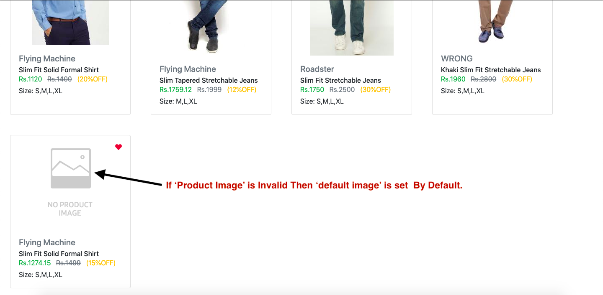
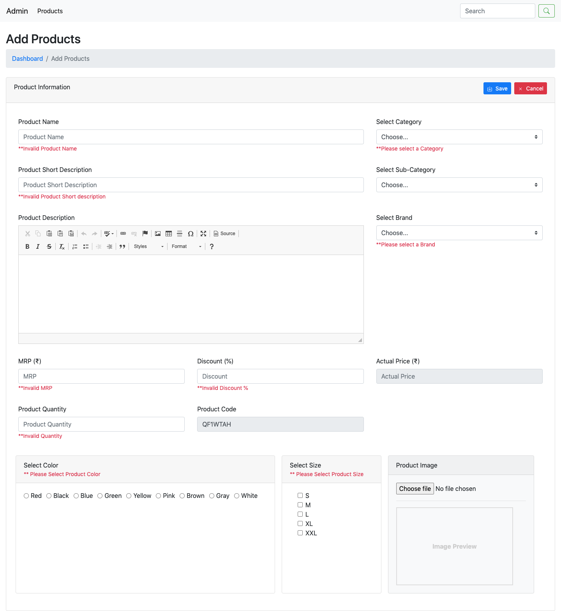
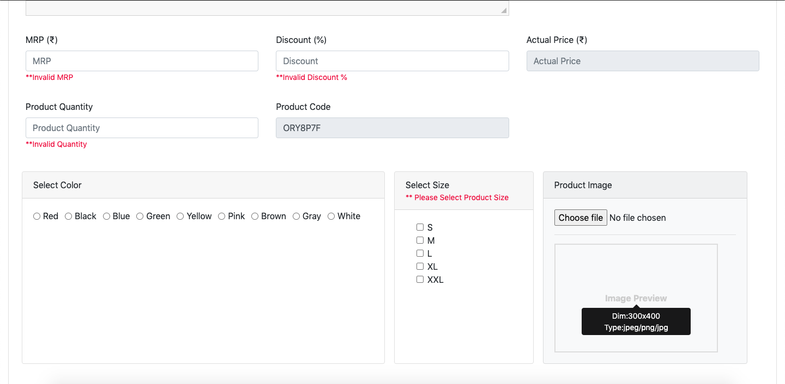
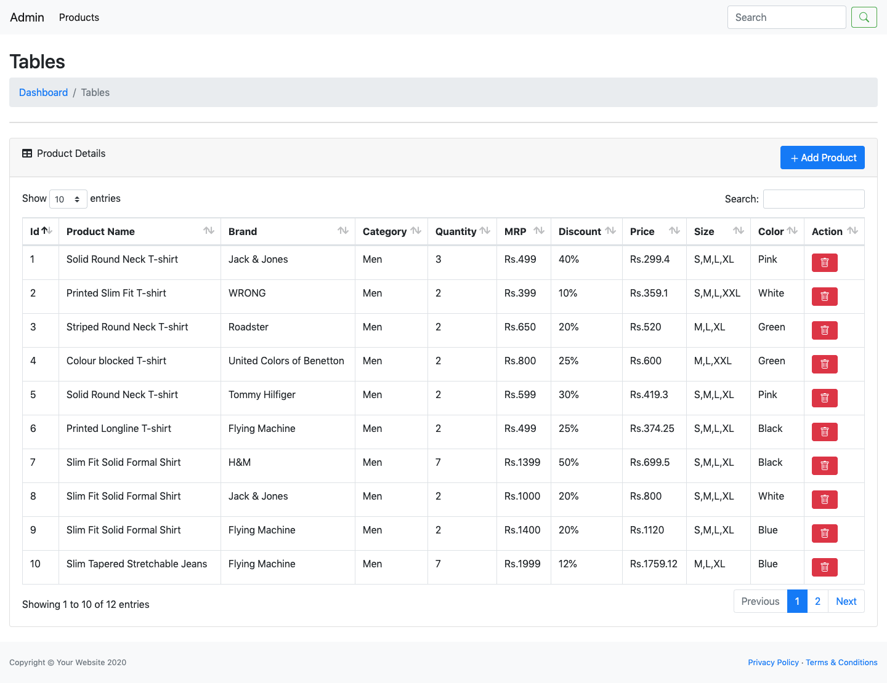
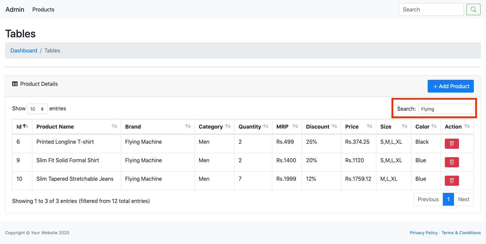
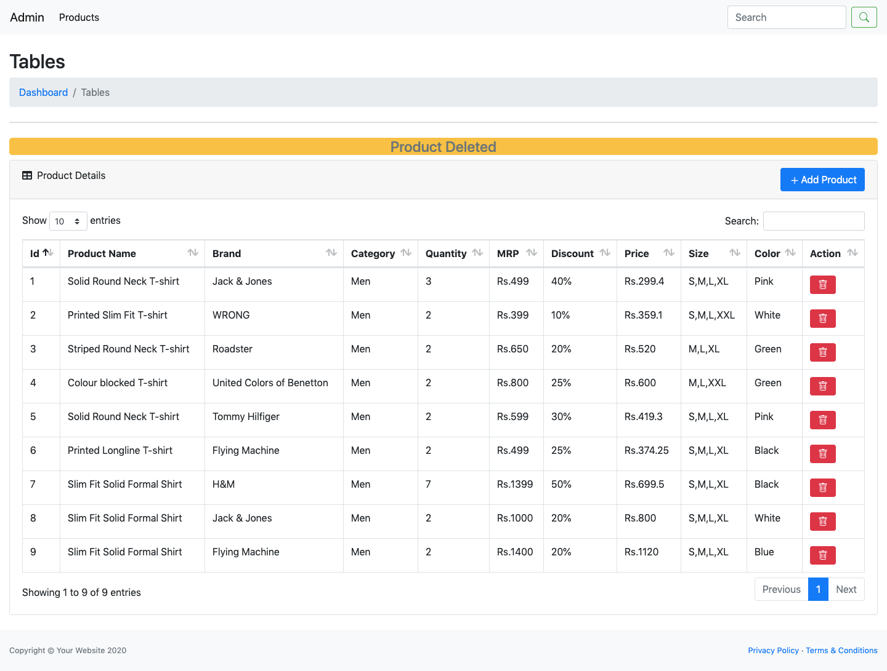

# Ecommerce_products
Add products to ecommerce website 

### 1. Products in ecommerce website. 

### 2. Default Product Image if not uploaded by Admin. 

### 3. Add Product to ecommerce website through Admin Panel.

### 4. Product Validation in Admin Panel.

### 5. Tooltip  in Admin Panel.

### 6. Product Detail Table in Admin Panel.

### 7. Search in Product Detail Table in Admin Panel.

### 8. Delete Product Detail in Admin Panel.

